# Architecture Documentation

## Architecture Decision Records (ADRs)

### ADR-001: API-First Design with OpenAPI Code Generation

**Status**: Accepted

**Context**: The ingestion service exposes a REST API consumed by market operators and data analysts. API contracts must be unambiguous, evolvable, and consistently enforced between the spec and the Go implementation. Manual route/handler wiring is error-prone and drifts from documentation over time.

**Decision**: Adopt an API-first workflow where the OpenAPI 3.0.3 specification is the single source of truth:

| Stage | Tool | Artifact |
|-------|------|----------|
| Author | Modular YAML schemas | `docs/contracts/openapi/ingestion/v1/specs.yaml` + `schemas/` |
| Lint | Redocly CLI | Validates against `recommended` ruleset |
| Bundle | swagger-cli | `public/swagger-pact.json` (single-file, preserves component names) |
| Generate | oapi-codegen v2 | `StrictServerInterface`, chi router, request/response models |
| Implement | Go | `StrictServerImplementation` satisfies the generated interface |

Key design choices:
- **Strict-server mode**: generates typed `*RequestObject` / `*ResponseObject` per operation — compile-time contract enforcement, not runtime reflection
- **Chi-server mode**: generates chi route registration from `operationId` ordering — route precedence matches spec order (e.g., `/interchanges/reprocess` before `/interchanges/{id}`)
- **Embedded spec**: the bundled JSON is embedded in the binary for runtime spec serving
- **Schema modularity**: response entities, error shapes, and examples live in separate YAML files under `schemas/`, enabling reuse across API versions

**Consequences**:
- Compile errors on contract drift (new endpoint or changed schema requires regeneration)
- Frontend/consumer teams can develop against the spec before backend implementation
- Pact JSON artifact enables consumer-driven contract testing
- Adding a new endpoint requires editing the spec first, then regenerating — intentional friction that prevents undocumented APIs
- oapi-codegen dependency for code generation (build-time only, not runtime)

### ADR-002: Clean Hexagonal Architecture

**Status**: Accepted

**Context**: Need a maintainable, testable architecture for an ingestion service with multiple external dependencies (PostgreSQL, Kafka, EDIFACT files).

**Decision**: Adopt Clean Hexagonal Architecture with:
- Ports (interfaces) defining contracts in `internal/ports/`
- Adapters implementing ports in `internal/adapters/{inbound,outbound,repos,services}/`
- Domain logic isolated in `internal/domain/model/`

**Consequences**:
- Swappable adapters (e.g., replace Kafka with NATS without touching business logic)
- High testability (mock any adapter via counterfeiter)
- Clear separation of concerns
- More boilerplate code (port interface per dependency)

### ADR-003: CQS with Decorator Pattern

**Status**: Accepted

**Context**: Need structured handling for both commands (file ingestion) and queries (interchange retrieval, message listing) with cross-cutting concerns.

**Decision**: Implement CQS (Command-Query Separation) with:
- Generic `QueryHandler[Q, R]` interface for both commands and queries
- Decorator chain: Logging -> Metrics -> Tracing -> Handler
- Separate command/query packages under `internal/usecases/`

**Consequences**:
- Consistent handler pipeline for all operations
- Easy to add decorators (caching, rate limiting) without touching handlers
- Observable by default (every operation logged, metriced, traced)
- Slight overhead for simple queries, but scales well

### ADR-004: Streaming Lexer/Parser for EDIFACT

**Status**: Accepted

**Context**: EDIFACT files range from KB to several MB. Need memory-efficient parsing with good error diagnostics.

**Decision**: Two-stage pipeline:
- **Lexer**: 64 KB buffered streaming tokenizer with lookahead
- **Parser**: Token stream consumer producing structured `ParseResult`
- Non-fatal error accumulation (collect all errors before returning)
- Position tracking (line/column) for error diagnostics

**Consequences**:
- Memory-efficient (streaming, not load-all)
- Rich error messages with file positions
- Testable stages (lexer and parser independently)
- Supports future parallel parsing per message

### ADR-005: SHA-256 Content Hash for Idempotency

**Status**: Accepted

**Context**: Files may be resubmitted accidentally. Need to prevent duplicate processing without distributed locking.

**Decision**: Compute SHA-256 hash of raw file content, store as UNIQUE constraint:
- Check `FindByContentHash` before parsing
- If exists, return existing result (no reparse)
- DB-level uniqueness enforces idempotency even under concurrent requests

**Consequences**:
- Zero-cost deduplication after first ingestion
- No distributed coordination needed
- Hash computation adds ~1ms for typical files
- Intentional reprocessing uses a separate code path (different version, same hash)

### ADR-006: JSONB for Parsed Segments

**Status**: Accepted

**Context**: EDIFACT format versions change twice yearly. Rigid schemas would require migrations on every format change.

**Decision**: Store parsed message segments as JSONB:
- Schema-free column in `messages.segments`
- GIN index for future path queries
- Parser evolution without schema migrations

**Consequences**:
- New parser versions add fields without DDL changes
- Flexible querying via JSONB operators
- Slightly larger storage vs normalized columns
- No compile-time schema validation (trade-off accepted)

### ADR-007: Post-Commit Event Publishing

**Status**: Accepted

**Context**: Need to publish domain events to Kafka after successful database writes. Must avoid distributed transactions.

**Decision**: Publish events after transaction commit (not within):
- Domain events stored in `domain_events` table (audit trail)
- Kafka publish is best-effort post-commit
- Failure logged but does not fail ingestion
- Kafka key = InterchangeID (partition ordering)

**Consequences**:
- No distributed transaction complexity
- At-most-once delivery to Kafka (acceptable for this domain)
- Audit trail in DB always consistent
- Future: add outbox pattern if exactly-once needed

### ADR-008: UUID v7 Primary Keys

**Status**: Accepted

**Context**: Need globally unique, time-sortable identifiers for all entities.

**Decision**: Use UUID v7 via PostgreSQL `pg_uuidv7` extension:
- Time-ordered (embeds Unix timestamp)
- Sortable by creation time without additional column
- B-tree friendly (monotonically increasing)

**Consequences**:
- Natural ordering without `created_at` sorts
- Better index locality than UUID v4
- Requires `pg_uuidv7` extension installed
- Keyset pagination uses UUID directly

### ADR-009: Functional Options for Runtime Initialization

**Status**: Accepted

**Context**: Need flexible, testable dependency initialization with clear error propagation and test override support.

**Decision**: Use a two-layer functional options pattern across a 4-file runtime package:

| File | Responsibility |
|------|---------------|
| `dispatcher.go` | `ServiceCtx` lifecycle: build, start, shutdown, cleanup |
| `deps.go` | Dependency struct groups + `initializeDependencies` |
| `options.go` | `ServiceOption` functions (configure `ServiceCtx`) |
| `dependency_options.go` | `DependencyOption` functions (configure `dependencies`) |

- **`ServiceOption`** configures `ServiceCtx` before `Run()` (e.g., `WithWaitingForServer`)
- **`DependencyOption`** configures infrastructure, repos, services, and application layers
- Override-before-default ordering: `slices.Concat(overrides, defaultOptions(ctx))` — each default has a nil-check guard so pre-injected overrides are preserved
- Test overrides (`WithExternalConfig`, `WithExternalDB`, `WithExternalKafkaWriter`) pass through `Build(opts ...DependencyOption)`
- Graceful shutdown via signal handling (SIGTERM/SIGINT, 10 s timeout)
- `net.Listen` + `Serve(listener)` pattern eliminates server-readiness race conditions

**Consequences**:
- Each initialization stage testable in isolation via `DependencyOption` overrides
- Clear startup order visible in `defaultOptions` chain
- Graceful shutdown prevents data loss
- Single entry point in `main.go`: `runtime.New().Run()`
- Two option layers keep service lifecycle concerns separate from dependency wiring

### ADR-010: Shared Logger Module with Embedded zerolog

**Status**: Accepted

**Context**: The logger was defined inside `internal/infrastructure/`, making it unavailable to other services in the workspace. Every log call required passing `ctx` explicitly, adding boilerplate to startup and shutdown paths that have no request context. Global log level via `zerolog.SetGlobalLevel()` caused race conditions in parallel tests.

**Decision**: Extract the logger to `pkg/logger/` as a separate Go workspace module:
- Embed `zerolog.Logger` as a value type (not pointer) for zero-cost composition
- Opt-in context enrichment via `WithContext(ctx)` — extracts correlation_id, request_id, trace_id, span_id
- Per-instance log level via `logger.Level()` instead of global state
- Configurable output format (JSON for production, console for development)

**Consequences**:
- Reusable across all workspace services without import cycle risk
- No forced `ctx` parameter on lifecycle logging (startup, shutdown)
- Race-free parallel tests (no global log level mutation)
- Decorator pattern preserved — decorators call `logger.WithContext(ctx)` for request-scoped fields
- Value-type semantics eliminate nil-check guards throughout dependency injection

---

## C4 Diagrams

### Context Diagram

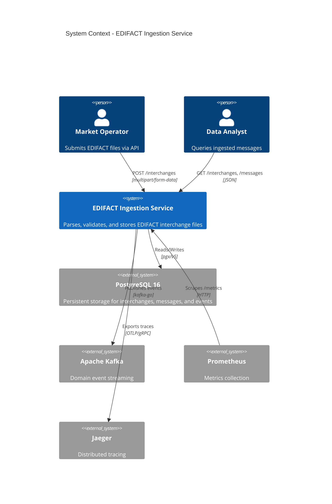

### Container Diagram

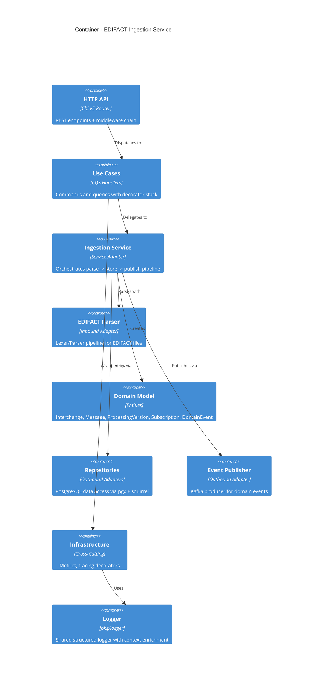

### Component Diagram

```mermaid
C4Component
    title Component - EDIFACT Ingestion Service Internals

    Container_Boundary(http, "HTTP Layer") {
        Component(router, "Router", "Chi v5", "Route registration and middleware chain")
        Component(handler, "StrictServerImpl", "oapi-codegen", "OpenAPI-generated strict server handlers")
        Component(correlation, "CorrelationID", "Middleware", "Extracts/generates X-Correlation-ID")
        Component(reqlog, "RequestLogging", "Middleware", "Logs method, path, status, duration")
        Component(metricsmw, "MetricsMiddleware", "Middleware", "Records latency and status counters")
        Component(tracing, "Tracing", "Middleware", "OpenTelemetry span creation")
        Component(recovery, "PanicRecovery", "Middleware", "Catches panics, returns 500")
    }

    Container_Boundary(usecase, "Use Case Layer") {
        Component(ingestcmd, "IngestFileHandler", "Command", "Delegates to IngestionService.IngestFile")
        Component(getinterchange, "GetInterchangeHandler", "Query", "Fetches interchange detail")
        Component(getraw, "GetRawFileHandler", "Query", "Returns raw EDIFACT bytes")
        Component(listmsgs, "ListMessagesHandler", "Query", "Filtered message listing with pagination")
        Component(health, "HealthHandlers", "Query", "Health, liveness, readiness checks")
        Component(logdeco, "LoggingDecorator", "Decorator", "Cross-cutting query/command logging")
        Component(metdeco, "MetricsDecorator", "Decorator", "Operation duration and counts")
        Component(tradeco, "TracingDecorator", "Decorator", "OpenTelemetry span per operation")
    }

    Container_Boundary(svc, "Service Layer") {
        Component(ingsvc, "IngestionService", "Service", "Orchestrates parse -> validate -> persist -> publish")
    }

    Container_Boundary(edifact, "EDIFACT Parser") {
        Component(delimiters, "Delimiters", "Value Object", "UNA service string advice parsing")
        Component(lexer, "Lexer", "Tokenizer", "64 KB buffered streaming scanner")
        Component(tokens, "Token", "Value Object", "TokenSegmentTag, TokenDataElement, TokenComponent, etc.")
        Component(edparser, "Parser", "Parser", "UNB/UNH/UNT/UNZ validation and extraction")
    }

    Container_Boundary(domain, "Domain Layer") {
        Component(interchange, "Interchange", "Entity", "EDIFACT file envelope with raw content")
        Component(message, "Message", "Entity", "Individual parsed message with JSONB segments")
        Component(procver, "ProcessingVersion", "Entity", "Parser pass with version tracking")
        Component(subscription, "Subscription", "Entity", "Metering point (LOC 172)")
        Component(domevent, "DomainEvent", "Entity", "Immutable audit event")
    }

    Container_Boundary(ports, "Ports") {
        Component(parserport, "FileParser", "Interface", "Parse contract")
        Component(intrepo, "InterchangeRepository", "Interface", "Interchange persistence contract")
        Component(verrepo, "ProcessingVersionRepository", "Interface", "Version management contract")
        Component(msgrepo, "MessageRepository", "Interface", "Message bulk operations contract")
        Component(subrepo, "SubscriptionRepository", "Interface", "Subscription upsert contract")
        Component(pubport, "EventPublisher", "Interface", "Event publishing contract")
        Component(txport, "TransactionManager", "Interface", "Transaction boundary contract")
        Component(healthport, "HealthChecker", "Interface", "Dependency health contract")
    }

    Container_Boundary(adapters, "Outbound Adapters") {
        Component(intrepoimpl, "InterchangeRepo", "pgx + squirrel", "PostgreSQL interchange storage")
        Component(verrepoimpl, "ProcessingVersionRepo", "pgx + squirrel", "PostgreSQL version storage")
        Component(msgrepoimpl, "MessageRepo", "pgx + squirrel", "PostgreSQL message bulk insert")
        Component(subrepoimpl, "SubscriptionRepo", "pgx + squirrel", "PostgreSQL subscription upsert")
        Component(kafkapub, "KafkaPublisher", "kafka-go", "Gzip-compressed, synchronous Kafka writes")
    }

    Rel(router, handler, "Routes to")
    Rel(recovery, router, "Wraps")
    Rel(correlation, recovery, "Wraps")
    Rel(handler, logdeco, "Executes")
    Rel(logdeco, metdeco, "Decorates")
    Rel(metdeco, tradeco, "Decorates")
    Rel(tradeco, ingestcmd, "Decorates")
    Rel(ingestcmd, ingsvc, "Calls")
    Rel(ingsvc, parserport, "Uses")
    Rel(ingsvc, intrepo, "Uses")
    Rel(ingsvc, verrepo, "Uses")
    Rel(ingsvc, msgrepo, "Uses")
    Rel(ingsvc, subrepo, "Uses")
    Rel(ingsvc, pubport, "Uses")
    Rel(ingsvc, txport, "Uses")
    Rel(edparser, lexer, "Consumes tokens from")
    Rel(lexer, delimiters, "Configured by")
    Rel(lexer, tokens, "Produces")
    Rel(intrepoimpl, intrepo, "Implements")
    Rel(verrepoimpl, verrepo, "Implements")
    Rel(msgrepoimpl, msgrepo, "Implements")
    Rel(subrepoimpl, subrepo, "Implements")
    Rel(kafkapub, pubport, "Implements")
    Rel(ingsvc, interchange, "Creates")
    Rel(ingsvc, message, "Creates")
    Rel(ingsvc, procver, "Creates")
    Rel(ingsvc, subscription, "Upserts")
    Rel(ingsvc, domevent, "Emits")
```

---

## Sequence Diagrams

### File Ingestion Flow (Happy Path)

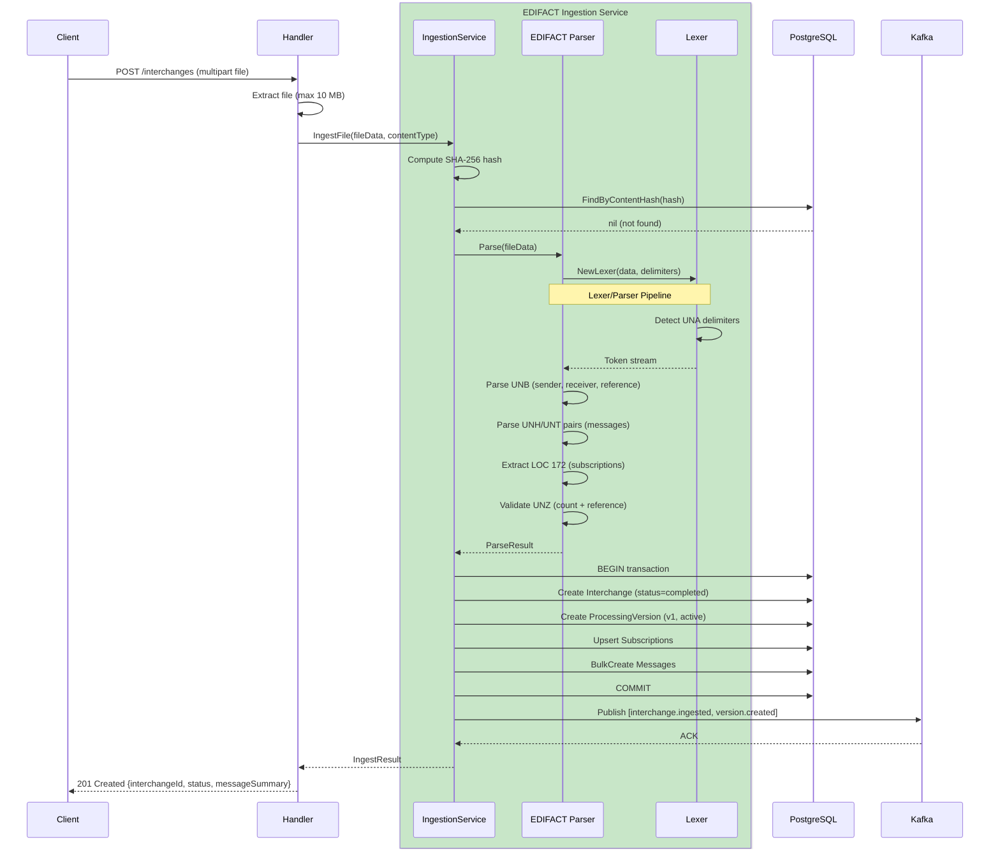

### File Ingestion Flow (Parse Failure)

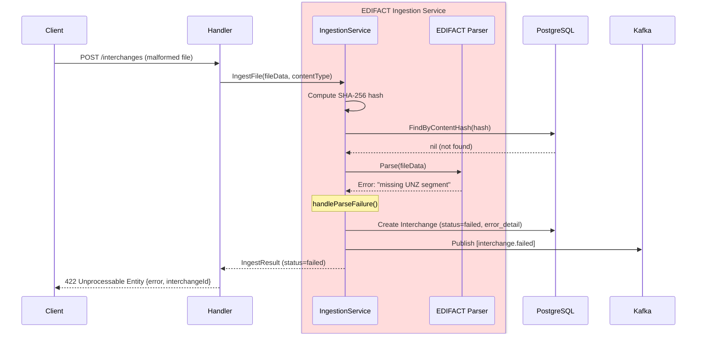

### Idempotent Re-submission

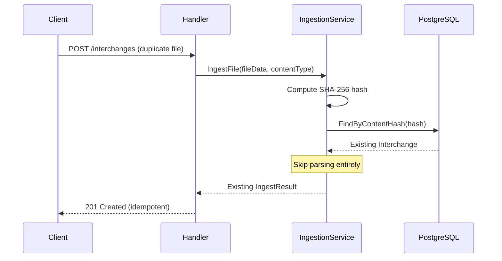

### Query Flow: Get Interchange Detail

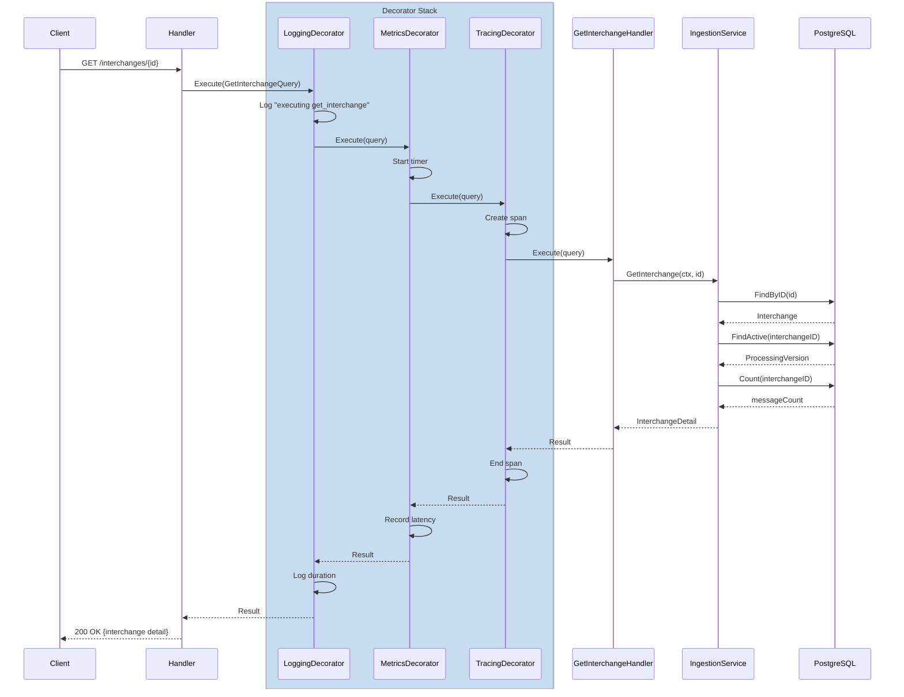

---

## Data Flow Diagram

### Ingestion Pipeline

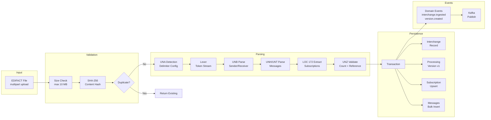

---

## Error Handling Flow

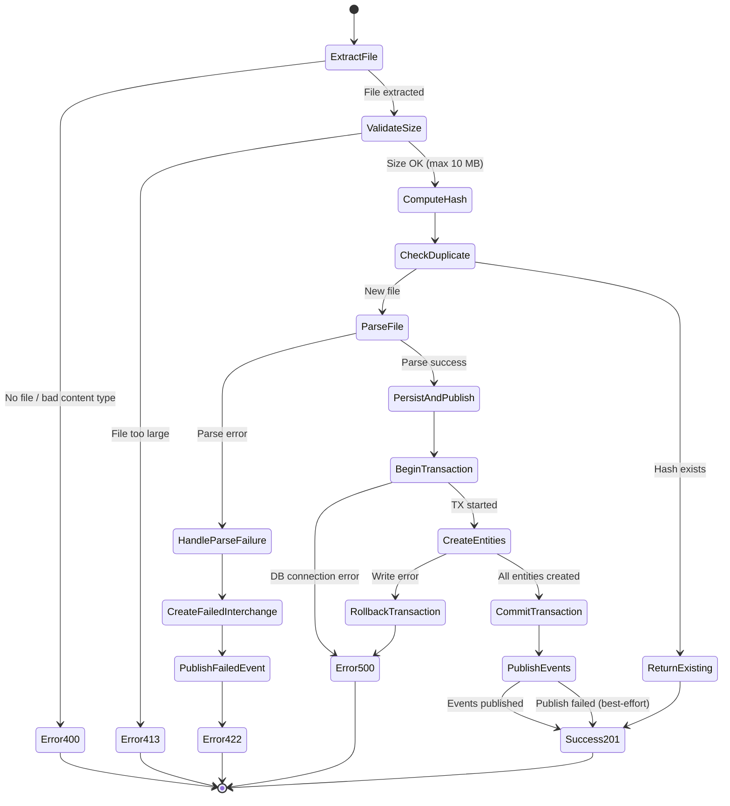

---

## Entity Relationship Diagram

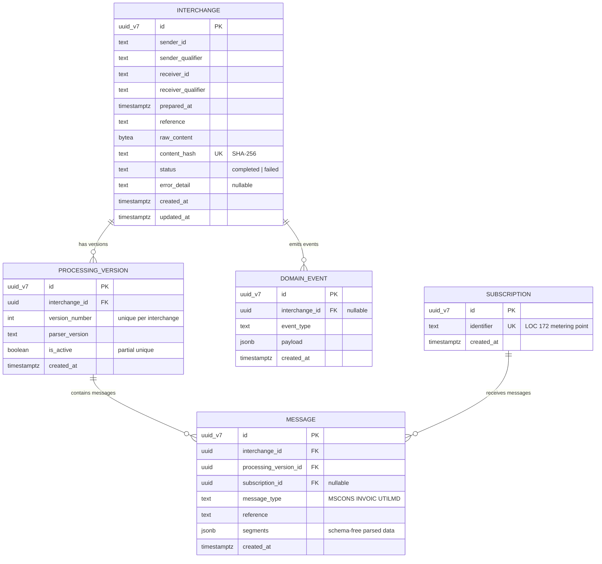

---

## Algorithm Visualization

### EDIFACT Lexer/Parser Pipeline

The EDIFACT parsing uses a **two-stage pipeline** that transforms raw byte streams into structured domain objects. This enables memory-efficient processing of files ranging from KB to several MB.

---

### Parser Pipeline Flowchart

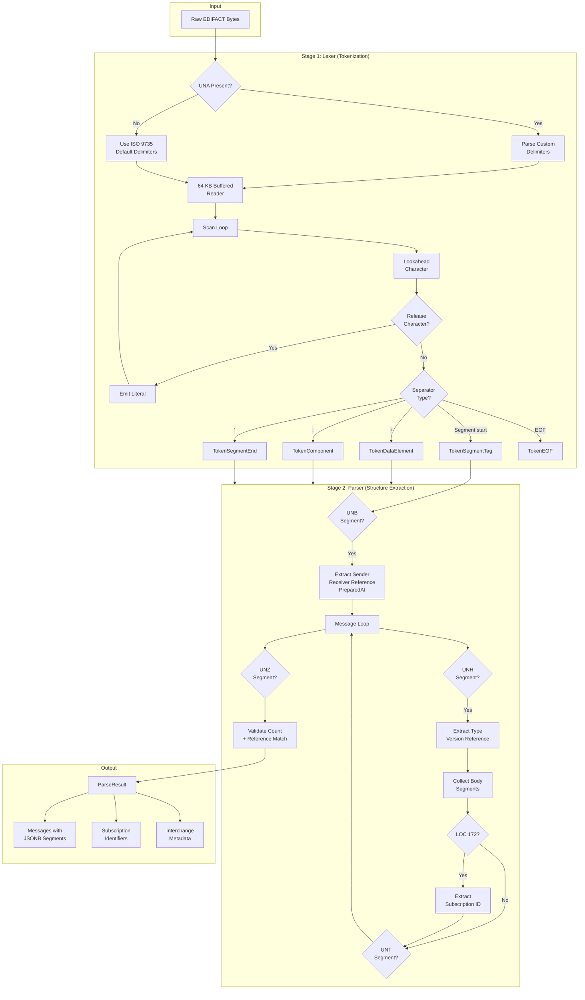

---

### Complete Example

This example traces an EDIFACT MSCONS file through the entire ingestion pipeline, showing tokenization, parsing, and persistence.

#### Raw EDIFACT Input

```
UNA:+.? '
UNB+UNOC:3+9900123456789:14+9900987654321:14+240115:1030+REF001'
UNH+1+MSCONS:D:04B:UN:2.3a'
BGM+7+12345+9'
LOC+172+DE0000801043700000000000011145670'
UNT+4+1'
UNZ+1+REF001'
```

---

#### Step 1: UNA Detection & Delimiter Configuration

**Purpose**: Determine the delimiter set for the file. UNA is optional; if absent, ISO 9735 defaults apply.

```
UNA:+.? '
    │││││
    ││││└─ Segment Terminator: '
    │││└── Release Character:  ?
    ││└─── Repetition:         (space = unused)
    │└──── Decimal Notation:   .
    └───── Data Element Sep:   +
Component Separator: : (first char after UNA)
```

| Delimiter | Character | Purpose |
|-----------|-----------|---------|
| Component Separator | `:` | Separates composite sub-elements |
| Data Element Separator | `+` | Separates data elements |
| Decimal Notation | `.` | Decimal point in numbers |
| Release Character | `?` | Escape next character as literal |
| Segment Terminator | `'` | Marks end of segment |

---

#### Step 2: Lexer Tokenization

**Purpose**: Transform raw bytes into a typed token stream with position tracking.

| Token # | Type | Value | Position |
|---------|------|-------|----------|
| 1 | `TokenUNA` | `UNA:+.? '` | 1:1 |
| 2 | `TokenSegmentTag` | `UNB` | 2:1 |
| 3 | `TokenDataElement` | `UNOC` | 2:5 |
| 4 | `TokenComponent` | `3` | 2:10 |
| 5 | `TokenDataElement` | `9900123456789` | 2:12 |
| 6 | `TokenComponent` | `14` | 2:26 |
| 7 | `TokenDataElement` | `9900987654321` | 2:29 |
| 8 | `TokenComponent` | `14` | 2:43 |
| 9 | `TokenDataElement` | `240115` | 2:46 |
| 10 | `TokenComponent` | `1030` | 2:53 |
| 11 | `TokenDataElement` | `REF001` | 2:58 |
| 12 | `TokenSegmentEnd` | `'` | 2:64 |
| ... | ... | ... | ... |

**Key insight**: The lexer uses a state machine — `afterSegmentEnd = true` tells it the next alphanumeric sequence is a segment tag (e.g., `UNB`), not a data element value.

---

#### Step 3: Parser Structural Extraction

**Purpose**: Consume the token stream and build a structured `ParseResult`.

<details>
<summary><b>UNB Parsing</b> — Interchange envelope header</summary>

```
UNB+UNOC:3+9900123456789:14+9900987654321:14+240115:1030+REF001'
    ├─ DE1 ─┤├──── DE2 ────┤├──── DE3 ────┤├── DE4 ──┤├─ DE5 ─┤

Data Element 1: Syntax identifier
  Component 1: UNOC (character set)
  Component 2: 3 (syntax version)

Data Element 2: Sender
  Component 1: 9900123456789 (sender ID)
  Component 2: 14 (qualifier - BDEW routing address)

Data Element 3: Receiver
  Component 1: 9900987654321 (receiver ID)
  Component 2: 14 (qualifier)

Data Element 4: Date/Time
  Component 1: 240115 → 2024-01-15 (YYMMDD)
  Component 2: 1030 → 10:30 (HHMM)
  Combined: 2024-01-15T10:30:00Z

Data Element 5: Reference
  REF001 (interchange control reference)
```

</details>

<details>
<summary><b>UNH/UNT Parsing</b> — Message envelope</summary>

```
UNH+1+MSCONS:D:04B:UN:2.3a'
    │ ├──────────────────────┤
    │ Message identifier composite
    │   Type:    MSCONS
    │   Version: D
    │   Release: 04B
    │   Agency:  UN
    │   Assoc:   2.3a
    └─ Reference: 1

Body segments collected:
  BGM+7+12345+9' → {tag: "BGM", elements: [["7"], ["12345"], ["9"]]}
  LOC+172+DE...  → {tag: "LOC", elements: [["172"], ["DE000..."]]}
    ↑ LOC qualifier 172 detected → subscription_id extracted

UNT+4+1' → Message trailer
  Segment count: 4 (UNH + BGM + LOC + UNT)
  Reference: 1 (must match UNH reference)
```

</details>

<details>
<summary><b>UNZ Validation</b> — Interchange trailer</summary>

```
UNZ+1+REF001'
    │ └─ Reference: REF001 (must match UNB reference ✓)
    └─── Message count: 1 (must match actual message count ✓)
```

</details>

---

#### Step 4: Persistence (Transactional)

```
BEGIN;
  ┌─────────────────────────────────────────────────────────────────┐
  │ INSERT INTO interchanges                                       │
  │   (sender_id, receiver_id, reference, raw_content,             │
  │    content_hash, status) VALUES (...)                          │
  │   → id: 0193a7b0-...                                          │
  ├─────────────────────────────────────────────────────────────────┤
  │ INSERT INTO processing_versions                                │
  │   (interchange_id, version_number=1, parser_version="1.0.0",   │
  │    is_active=TRUE) VALUES (...)                                │
  │   → id: 0193a7b1-...                                          │
  ├─────────────────────────────────────────────────────────────────┤
  │ INSERT INTO subscriptions (identifier)                         │
  │   VALUES ('DE0000801043700000000000011145670')                  │
  │   ON CONFLICT (identifier) DO NOTHING                          │
  │   → id: 0193a7b2-...                                          │
  ├─────────────────────────────────────────────────────────────────┤
  │ INSERT INTO messages                                           │
  │   (interchange_id, processing_version_id, subscription_id,     │
  │    message_type='MSCONS', reference='1', segments={...})       │
  │   → id: 0193a7b3-...                                          │
  └─────────────────────────────────────────────────────────────────┘
COMMIT;
```

---

#### Step 5: Event Publishing (Post-Commit)

```
Kafka Topic: edifact.events
Key: 0193a7b0-... (InterchangeID — partition ordering)

Event 1: interchange.ingested
{
  "event_id": "0193a7b4-...",
  "event_type": "interchange.ingested",
  "interchange_id": "0193a7b0-...",
  "message_count": 1,
  "sender": "9900123456789",
  "receiver": "9900987654321",
  "occurred_at": "2024-01-15T10:30:00Z"
}

Event 2: version.created
{
  "event_id": "0193a7b5-...",
  "event_type": "version.created",
  "interchange_id": "0193a7b0-...",
  "version_number": 1,
  "parser_version": "1.0.0",
  "occurred_at": "2024-01-15T10:30:00Z"
}
```

---

### Algorithm Complexity

| Operation | Time Complexity | Space Complexity |
|-----------|-----------------|------------------|
| SHA-256 hash | O(n) file size | O(1) |
| UNA detection | O(1) 9 bytes | O(1) |
| Lexer tokenization | O(n) single pass | O(64 KB) buffer |
| Parser extraction | O(tokens) | O(messages) |
| Subscription upsert | O(subscriptions) | O(1) per upsert |
| Message bulk insert | O(messages) | O(batch) |
| Idempotency check | O(1) hash lookup | O(1) |

Where:
- n = file size in bytes
- tokens = number of EDIFACT tokens (proportional to file size)
- messages = number of UNH/UNT pairs in the interchange
- subscriptions = number of unique LOC 172 identifiers

---

### Lexer State Machine

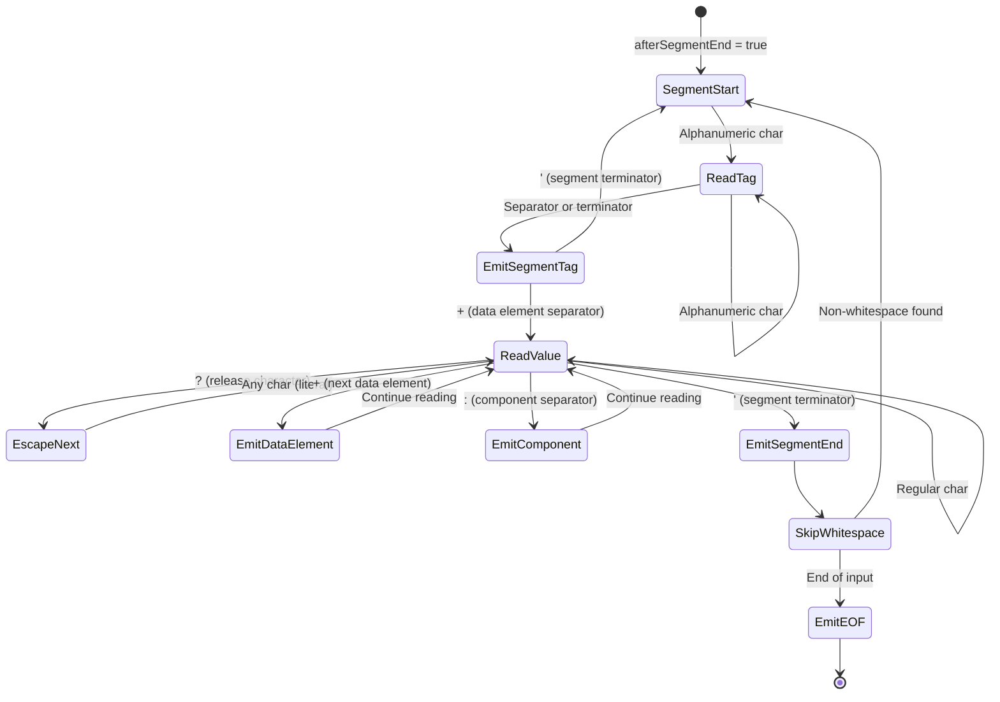

---

### Decorator Chain Execution

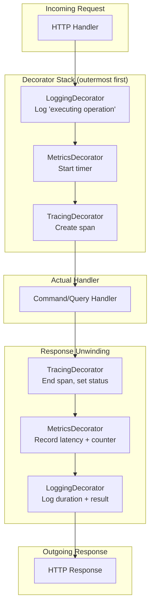

---

### Middleware Chain

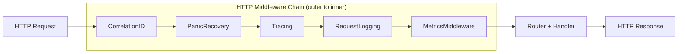

---

### Runtime Initialization Sequence

The runtime uses a `DependencyOption` chain where each option has a nil-check guard, enabling test overrides injected before defaults to be preserved. Migrations run via a dedicated Docker container (`migrate/migrate`) before the service starts.

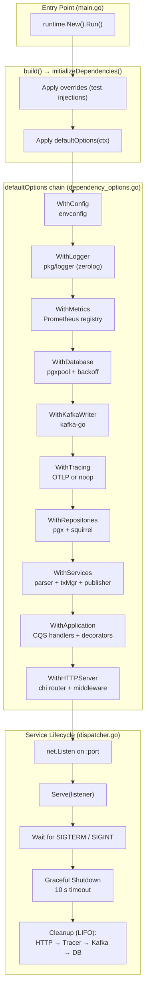

---

### Implementation Reference

| Component | File Path | Purpose |
|-----------|-----------|---------|
| **Entry Point** | `cmd/svc-ingestion/main.go` | Minimal bootstrap |
| **Ports** | `internal/ports/*.go` | Interface contracts |
| **Domain** | `internal/domain/model/*.go` | Core entities |
| **EDIFACT Lexer** | `internal/adapters/inbound/edifact/lexer.go` | Streaming tokenizer |
| **EDIFACT Parser** | `internal/adapters/inbound/edifact/parser.go` | Structure extraction |
| **EDIFACT Tokens** | `internal/adapters/inbound/edifact/token.go` | Token types |
| **EDIFACT Delimiters** | `internal/adapters/inbound/edifact/delimiters.go` | UNA parsing |
| **HTTP Handlers** | `internal/adapters/inbound/http/handlers/public/http_server_gen.go` | Generated strict server (oapi-codegen) |
| **HTTP Router** | `internal/adapters/inbound/http/router.go` | Route registration + middleware wiring |
| **HTTP Middleware** | `internal/adapters/inbound/http/middleware/*.go` | Request pipeline |
| **Repositories** | `internal/adapters/repos/*.go` | PostgreSQL data access |
| **Ingestion Service** | `internal/adapters/services/ingestion_service.go` | Orchestration logic |
| **Kafka Publisher** | `internal/adapters/outbound/kafka/event_publisher.go` | Event publishing |
| **Commands** | `internal/usecases/commands/*.go` | CQS command handlers |
| **Queries** | `internal/usecases/queries/*.go` | CQS query handlers |
| **Logger** | `pkg/logger/*.go` | Shared structured logger (zerolog) |
| **Infrastructure** | `internal/infrastructure/*.go` | Connection factories (`NewPostgres`, `NewKafkaWriter`, `NewTracerProvider`) |
| **Runtime Dispatcher** | `internal/runtime/dispatcher.go` | Service lifecycle (build, start, shutdown) |
| **Runtime Deps** | `internal/runtime/deps.go` | Dependency struct groups + initializer |
| **Runtime Options** | `internal/runtime/options.go` | `ServiceOption` functions |
| **Runtime Dep Options** | `internal/runtime/dependency_options.go` | `DependencyOption` functions + adapter types |
| **Code Generation** | `internal/tools/generate.go` | `//go:generate` directives for oapi-codegen |
| **Codegen Config** | `build/oapi/codegen-public.yaml` | oapi-codegen strict-server + chi-server config |
| **Config** | `internal/config/config.go` | Environment settings |
| **Migrations** | `migrations/*.sql` | Database schema |
| **OpenAPI** | `docs/contracts/openapi/ingestion/v1/specs.yaml` | API contract |

---

## Go Workspace Structure

The project uses a [Go workspace](https://go.dev/doc/tutorial/workspaces) (`go.work`) to manage multiple modules in a single repository. This enables shared packages to be developed alongside the service without publishing to a registry.

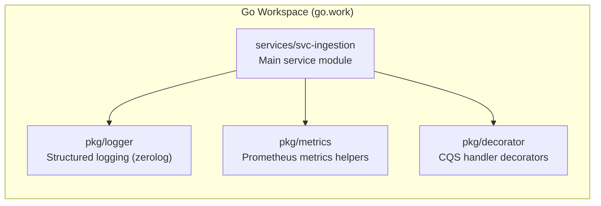

| Module | Path | Purpose |
|--------|------|---------|
| `svc-ingestion` | `services/svc-ingestion/go.mod` | Main ingestion service |
| `pkg/logger` | `pkg/logger/go.mod` | Shared structured logger with context enrichment |
| `pkg/metrics` | `pkg/metrics/go.mod` | Prometheus registry and helpers |
| `pkg/decorator` | `pkg/decorator/go.mod` | Generic CQS handler decorators (logging, metrics, tracing) |

Shared packages under `pkg/` are separate Go modules with their own `go.mod`. The workspace file (`go.work`) wires them together for local development — `go build`, `go test`, and IDE resolution work across module boundaries without `replace` directives.

---

## Build & Deployment Infrastructure

### Makefile System

The build system uses a modular Makefile structure under `build/mk/`:

| File | Purpose |
|------|---------|
| `Makefile` (root) | Entry point, includes all sub-makefiles |
| `build/mk/Makefile` | Main orchestrator |
| `build/mk/config/settings.mk` | Shared variables and paths |
| `build/mk/app.mk` | Application build targets (`build`, `run`, `generate`) |
| `build/mk/lint.mk` | Linting targets (`lint`, `lint-fix`) |
| `build/mk/test.mk` | Test targets (`test`, `test-integration`, `test-coverage`) |
| `build/mk/utils.mk` | Utility functions |

### OpenAPI Code Generation Pipeline

```
specs.yaml + schemas/
    │
    ▼ (Redocly lint)
specs.yaml validated
    │
    ▼ (swagger-cli bundle)
swagger-pact.json
    │
    ▼ (oapi-codegen + build/oapi/codegen-public.yaml)
handlers/public/http_server_gen.go
```

Generation is triggered via `go generate ./internal/tools/...` or `make generate`.

### Docker & Compose

| File | Purpose |
|------|---------|
| `compose.yaml` | Local development environment (all services) |
| `deployment/docker/compose.yaml` | Service-specific compose overrides |
| `services/svc-ingestion/deployment/docker/Dockerfile` | Multi-stage production image |
| `services/svc-ingestion/deployment/docker/config/air/.air.toml` | Hot-reload config for development |
| `deployment/docker/config/prometheus/prometheus.yaml` | Prometheus scrape targets |
| `deployment/docker/config/traefik/static.yaml` | Traefik reverse proxy (static config) |
| `deployment/docker/config/traefik/dynamic.yaml` | Traefik routing rules (dynamic config) |

### Database Migrations

Migrations run via `migrate/migrate` Docker container before the service starts. Schema files live in `services/svc-ingestion/migrations/` and follow the naming convention `NNN_description.{up,down}.sql`. Required PostgreSQL extensions (`uuid-ossp`, `pg_uuidv7`) are installed in the initial migration.
